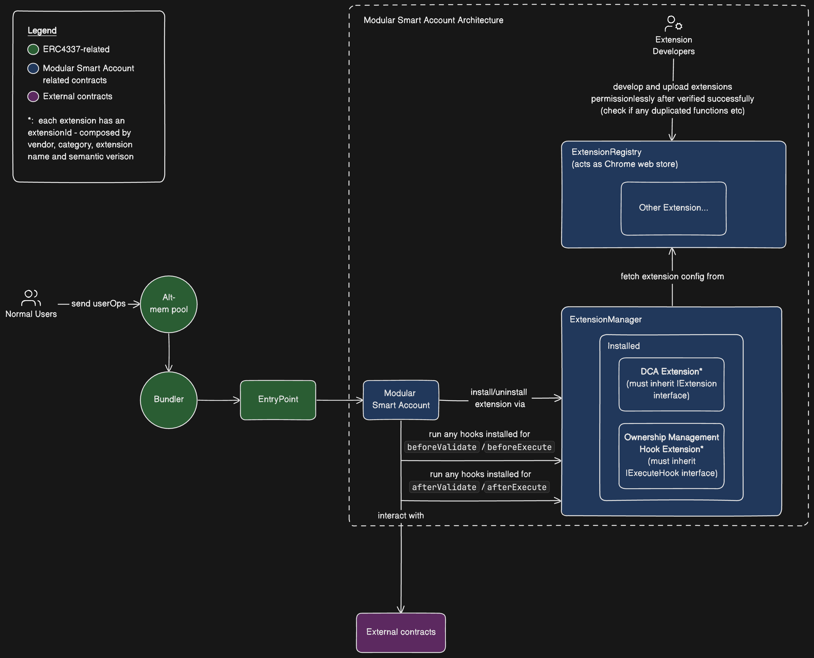

# Naive modular ERC-4337 compatible smart account design

## Getting Started

```
$ git clone https://github.com/0xdevant/naive-modular-smart-account
$ cd naive-modular-smart-account
$ forge install
```

## Project Structure

```
├── ExtensionManager.sol
├── ExtensionRegistry.sol
├── ModularSmartAccount.sol
├── extensions
│   ├── BaseExtension.sol
│   ├── DCAExtension.sol
│   └── OwnershipManagementHookExtension.sol
├── interfaces
│   ├── IExtensionManager.sol
│   ├── IExtensionRegistry.sol
│   ├── IModularSmartAccount.sol
│   └── extensions
│       ├── IDCAExtension.sol
│       ├── IExtension.sol
│       ├── IOwnershipManagementHookExtension.sol
│       └── hooks
│           ├── IExecuteHookExtension.sol
│           └── IValidateHookExtension.sol
└── libraries
    └── FuncSelectorsCheckLib.sol
```

## Technical Design

Here is the diagram for my architecture on the modular smart account(hereinafter **MSA**) design:


The design of my MSA is based on the concept of how **broswer extension** works. I think of these modular components like extensions, there is a **Extension Registry** that is responsible for listing all these extensions after they are verified and registered successfully, like an **chrome app store** but with permissionless listing. In order to install/uninstall extensions from the registry there is an **Extension Manager** abstracted in each MSA, you will call `installExtension` or `uninstallExtension`, and respective callback will be triggered to initialize/clean the extension if there is any `installCallBack` or `uninstallCallBack` written in the extension itself. Each extension will have their own extension id composed by vendor, category, extension name and semantic version for users to easily identify the extension to install/uninstall.

Every time when the entry point or any permissioned owners of the MSA call functions with function signature that doesn't exist in the MSA contract, the call will be directed to the `fallback` function to find if there are any extensions installed that match the function signature from that call, if so it will trigger that specific extension, or else the call will be reverted.

The MSA will be acted as a base layer that only contains minimal functionalities like what a basic smart account need such as `executeUserOp` and `_validateSignature`, and smart account users/developers are free to install any extensions they want for additional functionalities added to their MSA. At the moment for each MSA it can install one hook extension when it comes to the life cycle of validation i.e. `beforeValidate` and `afterValidate`, and one hook extension for the life cycle of execution i.e. `beforeExecute` and `afterExecute`. This part of the design is inspired by how I learn from the Uniswap v4 which developers can have hooks attached to their pool during different phrases of operations such as (before, after)swap, (before, after)add/removeLiquidity etc. To conclude two extensions in total will be allowed to install as hook extensions, one for validation and one for execution, and there is no limit for the number of non-hook extensions to be installed in one MSA.

## Usage

### Test

```shell
$ forge test
```

### Build

```shell
$ forge build
```

### Script

Deploy `ExtensionRegistry` and `ModularSmartAccount` contracts

```shell
$ forge script script/DeployRegistryAndMSA.s.sol
```

Deploy `OwnershipManagementHookExtension` and `DCAExtension` contracts

```shell
$ forge script script/DeployExtensions.s.sol
```

## Further Development

1. A Factory contract for creating & deploying ModularSmartAccount more easily and efficiently.
2. Can integrate Permit2 with DCA extension to have users only sign a EIP-712 signature without needing to approve the DCA extension beforehand to make the task subscription smoother.
3. Expand to allow multiple hooks for before/after validation and execution.
4. Add more (fuzz/invariant) tests to improve test coverage and the overall security.
